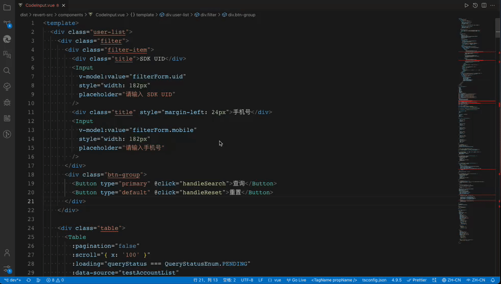

<br />

<p align="center">

</p>

<p align="center">
一个可以快速将中文项目中的中文替换成 i18n 国际化标记的插件。
</p>

## 如何使用

在使用前请在先安装 [@h1mple/auto-i18n-cli](https://github.com/baohangxing/auto-i18n/blob/main/packages/cli/README.md), 并进行初始的配置（后续版本会在插件中集成所有的功能）

使用前需要将`AutoConfig`中的`localesJsonDirs`进行重新配置，例如：

```txt
localesJsonDirs: [
    "/Users/code/work/project-name/src/lang/locales/**.json",
],
```

之后在 vscode 中安装本插件，进入想要进行操作的文件中，对应的操作会在邮件的菜单中出现。

## 演示



## issues

任何疑问或者问题 请提 issues: <https://github.com/baohangxing/auto-i18n/issues>
